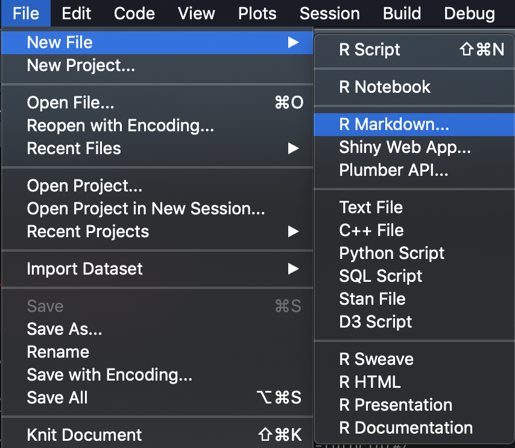

## Reproducible bioinformatics

Workshop details for [BioC Asia 2019](https://bioconductor.github.io/BiocAsia/).

* Title: Reproducible bioinformatics
* Presenter: Dave Tang
* Key words: Docker; Conda; Bioconda; RStudio Server; Reproducibility; Project management
* Description: This workshop will discuss guidelines for ensuring reproducibility in bioinformatic data analysis and demonstrate how we can adhere to these guidelines through the use of various computational tools. You will be introduced to Conda and Docker and shown how they can be used to simplify the deployment of bioinformatics tools and create isolated software environments ensuring that analyses can be reproduced. The workshop will also discuss approaches for organising computational projects using the workflowr R package. By the end of the workshop, you will have learned some ideas behind carrying out reproducible research and can better communicate and share your work in a reproducible manner.
* Requirements: You will need to bring your own laptop. Please make sure it has the latest version of R and RStudio Desktop installed. In addition, please install the latest versions of Miniconda and Docker. Some command line experience will be helpful but not required.
* Relevance: One of the most important aspects of scientific research is that someone else can reproduce your work. Even if a complex bioinformatics analysis is thoroughly described in the supplementary material of a paper and all raw data is provided, this doesn't guarantee that another other researchers can reproduce your work. This workshop is relevant to anyone who is interested in learning how to work in a manner that promotes reproducibility. In most cases, the person trying to reproduce your work is your future self. If you have looked back on your previous analyses and had trouble figuring out what you had done, this workshop is for you.

## Setup

Please install the following:

* Latest version of R - https://cran.r-project.org/
    * `workflowr` package - https://cran.r-project.org/web/packages/workflowr/index.html
* RStudio Desktop (Open Source Edition) - https://rstudio.com/products/rstudio/
    * Please install all packages needed to create and process R Markdown files by creating a new R Markdown file

* Miniconda (Python 3.7 version) - https://docs.conda.io/en/latest/miniconda.html
    * `cookiecutter` package - https://anaconda.org/conda-forge/cookiecutter
* Docker - https://docs.docker.com/install/
    * `rocker/rstudio` https://hub.docker.com/r/rocker/rstudio

## Useful links

* For Windows users, I wrote a [blog post](https://davetang.org/muse/2019/04/09/setting-up-windows-for-bioinformatics-in-2019/) on setting up Windows for bioinformatics
* https://davetang.org/muse/2018/02/09/organising-computational-biology-projects-cookiecutter/
* https://github.com/jdblischak/workflowr
* https://github.com/prakhar1989/docker-curriculum
* https://github.com/indigo-dc/udocker
* http://reproducible-bioinformatics.org/
* https://www.coursera.org/learn/reproducible-research
* https://leanpub.com/reportwriting
* https://geohackweek.github.io/Introductory/

